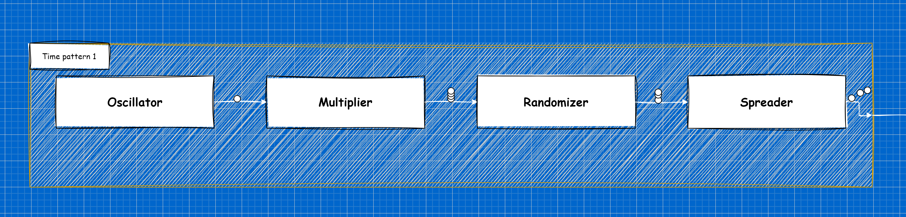

# Time Patterns

## Description

Input plugin for generating events with specific patterns of distribution in time.

Time pattern is determined by four components:
- **Oscillator** - defines the base frequency of event generation
- **Multiplier** - multiplies the number of events by the specified value
- **Randomizer** - increases or decreases the number of events
- **Spreader** - distribute events within one time interval



Several time patterns can be merged to achieve complex distribution.


## Parameters

Usage name: `time_patterns`

Supported modes: `live`, `sample`

<table>
    <th>Parameter</th>
    <th>Expected value</th>
    <th>Required</th>
    <th>Description</th>
    <tr>
        <td>`configs`</td>
        <td>`<list[str]>`</td>
        <td>Yes</td>
        <td>List of paths to time pattern configurations (several distributions are merged to resulting one)</td>
    </tr>
</table>

### Time pattern configuration

Time pattern configuration is a yaml file that has following format:
```yaml
label: <str>

oscillator:
  start: <str>
  end: <str>
  period: <int>
  unit: { seconds | minutes | hours | days }

multiplier:
  ratio: <int>

randomizer:
  deviation: <float>
  direction: { Decrease | Increase | Mixed }

spreader:
  distribution: { Uniform | Triangular | Beta }
  parameters:
    <parameter name>: <parameter value>
    ...
```

Time pattern parameters description:
<table>
    <th>Parameter</th>
    <th>Expected value</th>
    <th>Description</th>
    <tr>
        <td>`oscillator.start`</td>
        <td>`<time>` | `<datetime>` | `<relative time>` | `now`</td>
        <td>Start time of distribution; If relative time is provided current time used as base point</td>
    </tr>
    <tr>
        <td>`oscillator.end`</td>
        <td>`<time>` | `<datetime>` | `<relative time>` | `now` | `never`</td>
        <td>End time of distribution; If relative time is provided `oscillator.start` used as base point</td>
    </tr>
    <tr>
        <td>`oscillator.period`</td>
        <td>`<int>`</td>
        <td>Duration of one period</td>
    </tr>
    <tr>
        <td>`oscillator.unit`</td>
        <td>`seconds` | `minutes` | `hours` | `days`</td>
        <td>Time unit of the period</td>
    </tr>
    <tr>
        <td>`multiplier.ratio`</td>
        <td>`<int>`</td>
        <td>Multiplication ratio for number of events</td>
    </tr>
    <tr>
        <td>`randomizer.deviation`</td>
        <td>`<float>` (in range [0.0; 1.0])</td>
        <td>Deviation ratio for number of events</td>
    </tr>
    <tr>
        <td>`randomizer.direction`</td>
        <td>`Decrease` | `Increase` | `Mixed` </td>
        <td>Direction of deviation for number of events</td>
    </tr>
    <tr>
        <td>`spreader.distribution`</td>
        <td>`Uniform` | `Triangular` | `Beta` </td>
        <td>Probability function for distribution event within interval</td>
    </tr>
</table>

:::info
`<relative time>` - is expression in following format:
```
<expression> ::= [<sign>]<term>{<term>}...
<sign>  ::= '+' | '-'
<term>  ::= <value><unit>
<value> ::= <int>
<unit>  ::= 'd' | 'h' | 'm' | 's'
```
Examples: `1m30s`, `+2h`, `-15m`, `+1d12h30m5s`
:::

:::warning
Value `never` cannot be used for `oscillator.end` in `sample` mode.
:::

#### Spreader parameters for `Uniform` distribution:
<table>
    <th>Parameter</th>
    <th>Expected value</th>
    <th>Description</th>
    <tr>
        <td>`spreader.parameters.low`</td>
        <td>`<float>` (in range [0.0; 1.0])</td>
        <td>Start point of distribution within interval where `0.0` is start and `1.0` is end of interval</td>
    </tr>
    <tr>
        <td>`spreader.parameters.high`</td>
        <td>`<float>` (in range [0.0; 1.0])</td>
        <td>End point of distribution within interval where `0.0` is start and `1.0` is end of interval</td>
    </tr>
</table>


#### Spreader parameters for `Triangular` distribution
<table>
    <th>Parameter</th>
    <th>Expected value</th>
    <th>Description</th>
    <tr>
        <td>`spreader.parameters.left`</td>
        <td>`<float>` (in range [0.0; 1.0))</td>
        <td>Left point of distribution within interval where `0.0` is start and `1.0` is end of interval</td>
    </tr>
    <tr>
        <td>`spreader.parameters.mode`</td>
        <td>`<float>` (in range [0.0; 1.0])</td>
        <td>Mode point of distribution within interval where `0.0` is start and `1.0` is end of interval</td>
    </tr>
    <tr>
        <td>`spreader.parameters.right`</td>
        <td>`<float>` (in range (0.0; 1.0])</td>
        <td>Right point of distribution within interval where `0.0` is start and `1.0` is end of interval</td>
    </tr>
</table>


#### Spreader parameters for `Beta` distribution:
<table>
    <th>Parameter</th>
    <th>Expected value</th>
    <th>Description</th>
    <tr>
        <td>`spreader.parameters.a`</td>
        <td>`<float>` (in range [0.0; ∞))</td>
        <td>Parameter **α** of beta distribution</td>
    </tr>
    <tr>
        <td>`spreader.parameters.b`</td>
        <td>`<float>` (in range [0.0; ∞))</td>
        <td>Parameter **β** of beta distribution</td>
    </tr>
</table>


## Example

```yaml
time_patterns:
  configs:
    - "distribution1.yaml"
    - "distribution2.yaml"
    - "distribution3.yaml"
```