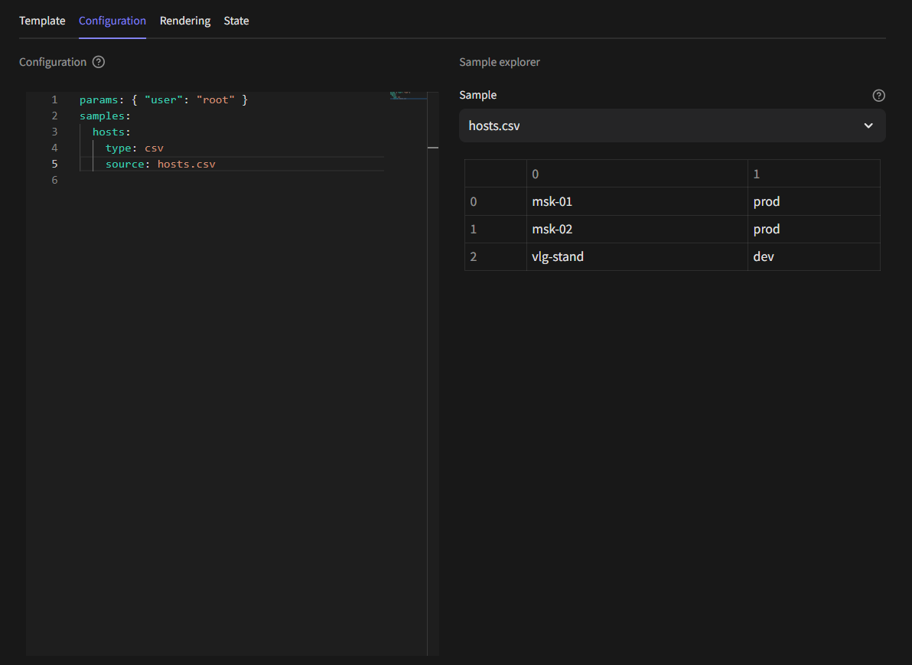
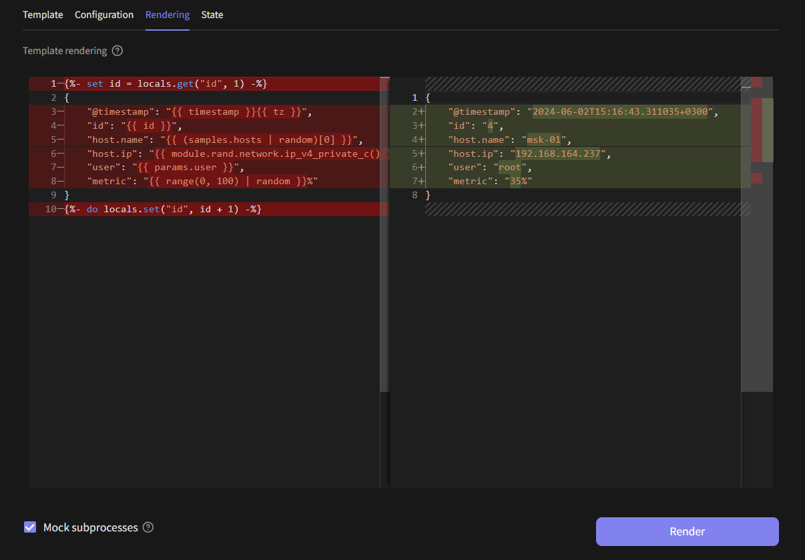
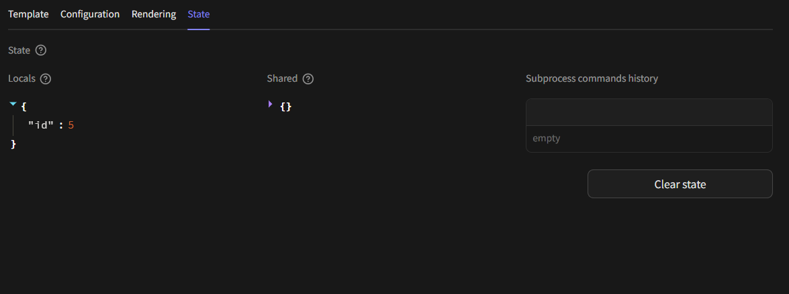

# Eventum Studio

## Introduction
Eventum Studio is  an integral component of the Eventum ecosystem, designed to enhance the user experience by providing an intuitive interface for creating and managing time distribution configurations and event templates. On this page you can read about the functionalities and benefits of using Eventum Studio for your event generation tasks.

## Time distribution
The **Time distribution** page in Eventum Studio is designed to provide you with an intuitive way to manage and visualize time patterns for event generation. This section is essential for configuring how events are scheduled and distributed over time, offering a high level of customization.

### Adjusting Time Patterns
The sidebar in the Time Distribution page is your control panel for creating and managing time patterns. Each time pattern is determined by four key components:

- **Oscillator** - defines the base frequency of event generation
- **Multiplier** - multiplies the number of events by a specified value, allowing you to scale up the frequency of events as needed
- **Randomizer** - introduces variability by increasing or decreasing the number of events, adding an element of randomness to your time pattern
- **Spreader** - distributes events within a single time interval, ensuring that events are spread out rather than occurring all at once

You can create new time patterns or reuse existing ones by loading them from time pattern configuration files.

### Mixing Time Patterns
One of the powerful features is the ability to mix several time patterns to achieve complex distributions. By combining different time patterns you can create sophisticated time distribution that closely imitate real-world scenarios.

### Distribution Histogram
The main section of the Time Distribution page features a distribution histogram, which visually represents the result of your time patterns.

This histogram shows:
- Individual distributions - how each configured time pattern looks in isolation
- Mixed distribution - the combined effect of all time patterns, giving a clear picture of the overall time distribution of events

## Event template
The **Event template** page in Eventum Studio is a versatile environment designed to streamline the creation, configuration, rendering, and state management of event templates. This page offers comprehensive tools to ensure your templates are well-designed and functional, providing a seamless experience from development to usage.

### Creating and loading template
The sidebar on the Event template page allows you to either create new templates from scratch or load existing ones. Main work are carried out in four following tabs.

### Template tab
The **Template** tab is where you can write and modify your event templates. It features a code editor with basic syntax highlighting and autocompletion, ensuring that your templates are accurate and easy to read.

### Configuration Tab
In the **Configuration** tab, you can define and adjust the parameters and samples used in your templates. There is also sample explorer there which will help you to quickly preview data and check sample structure.

### Rendering Tab
The **Rendering** tab allows you to render your templates and visually compare the output using a diff editor. This tool is valuable for ensuring that your template's output matches your expectations, highlighting any differences between the template code and the resulting events.

### State Tab
The **State** tab provides a real-time view of the current state of locals and shared variables used in your templates via State API. Additionally, it shows subprocesses that have been run from within the template. This helps in debugging and ensures that all parts of the template are functioning as intended.

